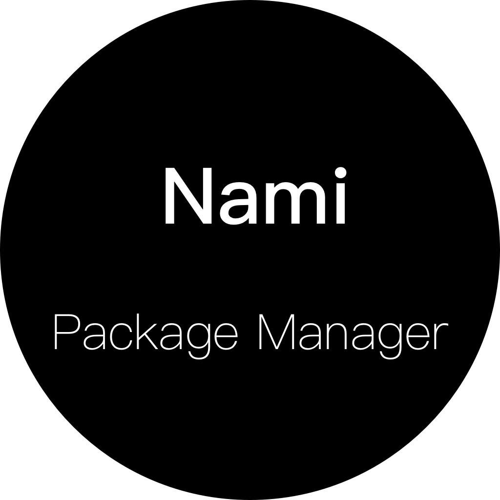

# Nami

[中文](readme_zh.md)

[](https://www.txthinking.com/opensource-support.html)
[](https://docs.google.com/forms/d/e/1FAIpQLSdzMwPtDue3QoezXSKfhW88BXp57wkbDXnLaqokJqLeSWP9vQ/viewform)

<p align="center">
    
</p>

A decentralized binary package manager

### Install

    $ curl -L https://git.io/getnami | bash && sleep 6 && exec -l $SHELL

> Windows user should run in [Git Bash](https://gitforwindows.org/)

### 💛 [awesome-nami](https://github.com/namipkg/awesome-nami)

### Example

```
$ nami install github.com/txthinking/nami
```

### Usage

```
NAME:
   nami - A decentralized binary package manager

USAGE:
   nami [global options] command [command options] [arguments...]

COMMANDS:
   install  Install package. $ nami install github.com/txthinking/nami
   upgrade  Upgrade package. $ nami upgrade github.com/txthinking/nami
   remove   Remove package. $ nami remove github.com/txthinking/brook
   info     Print package information. $ nami info github.com/txthinking/nami
   list     Print installed packages. $ nami list
   config   Configure key and value. $ nami config <key> <value>. See all keys, $ nami config
   release  Create or update a version with binaries directory, such as $ nami release github.com/txthinking/nami v1.1.1 ./binaries/
   help, h  Shows a list of commands or help for one command
```

### With HTTPS_PROXY environment

```
$ export HTTPS_PROXY=http://127.0.0.1:8888
$ nami install github.com/txthinking/nami
```

### What Does Nami Do?

All files are stored in `$HOME/.nami`

### Keep PATH with sudo 

```
$ sudo visudo
```

```
Defaults        !env_reset
# Defaults       secure_path=...
```

## Nami for Software Publisher

[wiki](https://github.com/txthinking/nami/wiki)

## Why

There are already many package managers, more are centralized and often provide outdated softwares.
Nami is a decentralized binary package manager,
she allows software authors to publish their software anywhere.
No longer have to worry about users downloading outdated software.
**Only install packages you trust**.

## Author

A project by [txthinking](https://www.txthinking.com)

## License

Licensed under The GPLv3 License
